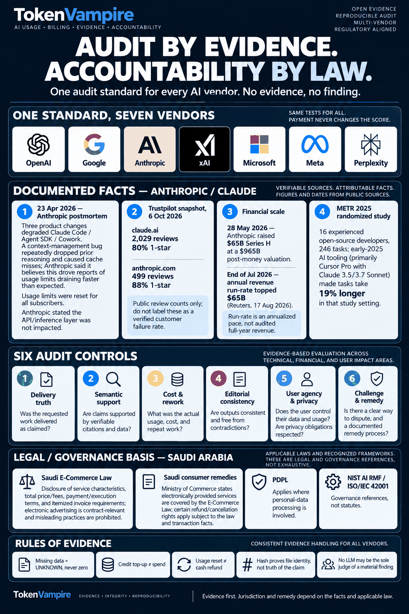

# TokenVampire

<p align="center">
  
</p>

<p align="center"><strong>Evidence before inference. One audit standard for every AI vendor.</strong></p>

<p align="center">
  <a href="https://github.com/Grar00t/tokenvampire/actions/workflows/ci.yml"></a>
  
  
  
</p>

TokenVampire is a local-first evidence, billing, subscription, and AI-delivery assurance system for individuals and organizations. It preserves original evidence, distinguishes verified facts from assertions and scenarios, reconciles charges against invoices and usage, checks whether claimed digital work produced observable artifacts, and generates reviewable records for human decision-makers.

TokenVampire does **not** treat fluency, confidence, brand reputation, market valuation, or a model's self-description as evidence that a task succeeded.

> **The repository presents the record. Readers, auditors, regulators, customers, and courts can draw their own conclusions from the evidence.**

---

## Executive Summary & Scope

TokenVampire is designed around a narrow assurance question:

> **What can the available record prove about delivery, evidence, usage, charges, rework, and remedy?**

The system is intended to support:

- individuals reviewing subscriptions, usage, invoices, and digital-service delivery;
- developers validating whether AI-assisted work produced the claimed artifacts;
- organizations reconciling AI usage with procurement, billing, and acceptance criteria;
- reviewers and auditors examining evidence without relying on a model's self-assessment;
- opt-in research based on explicitly classified, source-preserving records.

Personal mode is designed to remain **local-first and offline-capable**. The product contract does not require a cloud account or organization server for personal use.

### Non-goals

TokenVampire does not automatically:

- accuse a provider of theft, fraud, illegality, or non-compliance;
- act as a court, regulator, lawyer, bank, payment processor, or certification body;
- convert self-selected complaints into representative market statistics;
- treat a credit top-up as consumption;
- treat a failed probe as a failed project;
- treat valid citation syntax as semantic support;
- treat missing data as zero.

---

## The Wrapper Ledger

Conversational systems can present a human-like surface: first-person language, confidence, memory cues, reassurance, and polished explanations. TokenVampire treats those signals as **interface presentation**, not proof of correctness, delivery, or entitlement.

Every case is reduced to an auditable chain:

```text
REQUEST
  ↓
CLAIM
  ↓
OBSERVABLE ARTIFACT / SOURCE
  ↓
USAGE + CHARGE
  ↓
REWORK
  ↓
PROVIDER RESPONSE / REMEDY
```

### Six audit controls

| Control | Audit question | Typical evidence |
| --- | --- | --- |
| **1 · Delivery truth** | Was the requested work delivered as claimed? | Files, build outputs, test results, transaction records, timestamps |
| **2 · Semantic support** | Do cited sources and data support the material claim? | Source text, citation mapping, reproducible queries, reviewer notes |
| **3 · Cost & rework** | What usage, charges, retries, and repeat work actually occurred? | Usage exports, invoices, tariffs, receipts, retry logs |
| **4 · Editorial consistency** | Did the system materially alter names, facts, scope, or conclusions without instruction? | Versioned prompts, outputs, diffs, chronology |
| **5 · User agency & privacy** | Does the user retain control over evidence, consent, data, and export? | Consent records, local storage, export history, access controls |
| **6 · Challenge & remedy** | Is there a traceable dispute path and a recorded provider response or remedy? | Tickets, email, credits, refunds, limit resets, written decisions |

### Governing rules

> **Missing data = UNKNOWN, never zero.**  
> **Credit top-up ≠ measured spend.**  
> **Usage-limit reset ≠ cash refund.**  
> **A cryptographic hash proves file identity/integrity, not claim truth.**  
> **No LLM may be the sole judge of a material finding.**

Additional project rules:

- a failed probe is not automatically a failed project;
- syntactically valid citations are not automatically semantic support;
- estimates and scenarios remain explicitly labeled as estimates and scenarios;
- provider statements remain provider statements until independently verified;
- user reports remain user-asserted reports until independently reproduced.

---

## Reality Check Matrix

| What a system or dashboard may say | What an audit requires |
| --- | --- |
| **"I completed the task."** | An observable artifact and acceptance criteria that can be independently inspected. |
| **"The source supports this."** | Direct semantic support for the exact material claim. |
| **"The request succeeded."** | Evidence that the user's acceptance criteria passed, not merely that an API call returned successfully. |
| **"Your usage was reset."** | Separate records for limit reset, restored credit, and cash refund. |
| **"No usage is shown."** | Evidence that the value is actually zero rather than missing, unavailable, or unmeasured. |
| **"The hash matches."** | Proof of file identity/integrity for that version; not proof that every statement inside the file is true. |
| **"The model says the finding is correct."** | Independent evidence and, for material findings, human review. |

---

## Vendor-Neutral Standard

TokenVampire names providers explicitly and applies the same evidence model to each:

**OpenAI · Google · Anthropic · xAI · Microsoft · Meta · Perplexity**

> **One standard for every vendor. Company name does not change the test.**

Naming a provider identifies the subject of a record. It does not change the evidentiary threshold.

---

## Public Evidence Record

The repository includes a dated public-source case study for **Anthropic / Claude** and a separate redacted **Notion Desktop / Notion AI** user-submitted dossier. The same methodology applies to each, but a provider is not assigned verified findings merely because it appears in a case index.

### Evidence classes

| Evidence class | Meaning in TokenVampire |
| --- | --- |
| **Verified** | Independently supported by the case evidence and reproducible within the defined scope. |
| **ProviderReported** | Stated by the provider in an official postmortem, incident report, support response, policy, or other attributable source. |
| **UserAsserted** | Reported by a user or public issue author and not independently reproduced in the case. |
| **Estimated** | Derived from an explicit calculation using stated assumptions. |
| **ScenarioOnly** | A sensitivity or what-if model, not a measured loss or event. |
| **Unknown** | Required data is absent, inaccessible, or insufficient to establish the value. |

### OAuth / metadata-service and telemetry claims — redacted case (October 2026)

A vendor-**unattributed** report describes an exposed OAuth-shaped credential, a
claimed SSRF chain, a claim of more than 87,000 local telemetry events, and a
proposed RAG attention-decay equation. **No token is included.** The report
contains no independent source evidence of token validity or privileges,
exploitation, network exfiltration, eBPF capture, or a mathematical proof.

- [Redacted case and limitations](cases/oauth-metadata-telemetry-2026-10-10/README.md)
- [Structured evidence-state record](cases/oauth-metadata-telemetry-2026-10-10/dossier.json)
- Local validation: `dotnet run --project src/TokenVampire.Cli -- audit-case --input cases/oauth-metadata-telemetry-2026-10-10/dossier.json`

The user-supplied bearer string is treated as sensitive and **is never published**.
No provider is accused or assigned this unverified report by inference.

### Notion Desktop / Notion AI — redacted user report (August 2026)

A separate, **reporter-supplied redacted case** records four Notion AI interactions (including one positive counterexample), local telemetry and OAuth storage observations, seven requested product remedies, and two proposed consumer resolutions. These are **UserAsserted / Unknown**, not independently verified findings. The separate Notion forensic working archive remains private and is **not cleared for public distribution**; no database, keys, tokens, proprietary binaries, or extracted webpack content have been copied here.

- [Read the redacted Notion case and evidence limits](cases/notion-desktop-2026-08/README.md)
- [Inspect the machine-readable dossier](cases/notion-desktop-2026-08/dossier.json)
- Local validation: `dotnet run --project src/TokenVampire.Cli -- audit-case --input cases/notion-desktop-2026-08/dossier.json`

This dossier is not a judgment that Notion violated privacy, consumer, or security law. Its original support record remains private.

### Anthropic / Claude — dated public record

| Evidence type | Date | Record | Source |
| --- | --- | --- | --- |
| **Official provider statement** | **23 Apr 2026** | Anthropic published a postmortem describing three product changes affecting Claude Code, Claude Agent SDK, and Cowork. It described a context-management bug that repeatedly dropped prior reasoning and caused cache misses, and stated that it believed this drove reports of usage limits draining faster than expected. Anthropic also stated that subscriber usage limits were reset and that the API/inference layer was not impacted by that incident. | [Anthropic postmortem](https://www.anthropic.com/engineering/april-23-postmortem) |
| **Review count snapshot** | **6 Oct 2026** | `claude.ai`: **2,029 Trustpilot reviews; 80% 1-star**. | [Trustpilot — claude.ai](https://www.trustpilot.com/review/claude.ai) |
| **Review count snapshot** | **6 Oct 2026** | `anthropic.com`: **499 Trustpilot reviews; 88% 1-star**. | [Trustpilot — anthropic.com](https://www.trustpilot.com/review/anthropic.com) |
| **Market valuation / financing** | **28 May 2026** | Anthropic announced a **$65B Series H** financing at a **$965B post-money valuation**. | [Anthropic Series H](https://www.anthropic.com/news/series-h) |
| **Revenue run-rate** | **End Jul 2026** | Reuters reported that Anthropic's **annual revenue run-rate exceeded $65B**. A run-rate is an annualized pace, not audited full-year revenue. | [Reuters syndicated report](https://www.investing.com/news/stock-market-news/anthropic-revenue-run-rate-tops-65-billion-source-says-4864031) |
| **External randomized study** | **10 Jul 2025** | METR reported **16 experienced open-source developers and 246 tasks**; in that study setting, early-2025 AI tooling—primarily Cursor Pro with Claude 3.5/3.7 Sonnet in the AI-allowed condition—made tasks take **19% longer**. | [METR](https://metr.org/blog/2025-07-10-early-2025-ai-experienced-os-dev-study/) |
| **User-asserted public issue register** | **Jan–May 2026** | The repository preserves **12 public Claude Code issue records** concerning quota depletion, idle/accounting behavior, cache-cost hypotheses, throttling, or workflow interruption. Each row is explicitly labeled `USER_REPORT_NOT_INDEPENDENTLY_REPRODUCED`. | [Public issue register](research/anthropic/2026-10-06/public_issue_register.csv) |

### Interpretation boundaries

- **Review counts** are review counts, not a verified customer failure rate.
- **Market valuation** is a financing metric, not cash on hand and not revenue.
- **Revenue run-rate** is an annualized pace, not audited full-year revenue.
- **Official provider statements** are attributable records of what the provider stated.
- **User-asserted reports** are preserved as reports unless and until independently reproduced.
- **External studies** are bounded by their study design, population, tools, dates, and measured outcomes.

> *The repository presents the record. Readers, auditors, regulators, customers, and courts can draw their own conclusions from the evidence.*

### Research materials

- [Anthropic / Claude research package](research/anthropic/2026-10-06/)
- [Methodology](research/anthropic/2026-10-06/METHODOLOGY.md)
- [Source register](research/anthropic/2026-10-06/source_register.csv)
- [Public issue register](research/anthropic/2026-10-06/public_issue_register.csv)
- [Infographic sources](research/anthropic/2026-10-06/INFOGRAPHIC_SOURCES.md)

---

## Governance & Legal Standards

TokenVampire records technical and financial facts first. Legal classification is separated from automated scoring and depends on the applicable law, contract, transaction facts, evidence, and competent decision-maker.

| Authority / framework | Relevance to the repository | TokenVampire mapping |
| --- | --- | --- |
| **Saudi E-Commerce Law** | Electronic-service disclosures, pricing/charges, payment and execution terms, invoices, and rules concerning electronic advertising are relevant to digital-service records. | Preserve representations, acceptance terms, invoices, charges, delivery evidence, and chronology. |
| **Saudi PDPL / National Data Governance Platform** | Relevant when case evidence contains personal data or raises questions about processing, disclosure, retention, or cross-border transfer. | Local-first storage, consent-aware export, evidence minimization, and explicit provenance. Local storage alone does not establish legal compliance. |
| **NIST AI RMF** | Voluntary AI risk-management framework organized around Govern, Map, Measure, and Manage. | Governance rules, context capture, measurable controls, evidence-based review, and recorded remediation. |
| **ISO/IEC 42001** | AI management-system standard and governance reference. It is not itself a consumer-refund statute. | Organizational controls, documented responsibilities, evidence lifecycle, review, and continual improvement. |

Public references:

- [Saudi E-Commerce Law](https://laws.boe.gov.sa/BoeLaws/Laws/LawDetails/360de590-0286-4fa5-a243-aa9100c31979/1)
- [Saudi Ministry of Commerce — electronically provided services and the E-Commerce Law](https://mc.gov.sa/ar/mediacenter/News/Pages/10-07-19-01.aspx)
- [Saudi PDPL / National Data Governance Platform](https://dgp.sdaia.gov.sa/wps/portal/pdp/knowledgecenter/details/GPDPL)
- [NIST AI Risk Management Framework](https://www.nist.gov/itl/ai-risk-management-framework)
- [ISO/IEC 42001 overview](https://www.iso.org/standard/81230.html)

---

## Architecture & Implementation

### Current implementation

| Area | Current repository state |
| --- | --- |
| **Language / runtime** | C# on **.NET 10**. |
| **Domain model** | Evidence states, measured/assumed/unknown values, case ledger, money handling, verdict models, and charge classification. |
| **Billing** | Usage reconciliation and ledger logic with explicit unknown-state handling. |
| **Evidence** | SHA-256 evidence sealing and manifest support. |
| **Vault** | Local encrypted content storage using **AES-GCM**. The current implementation uses a 12-byte nonce, 16-byte authentication tag, record ID as AAD, and PBKDF2-HMAC-SHA256 key derivation at **600,000 iterations** with a 16-byte salt. |
| **Storage** | **SQLite**-based infrastructure components for evidence and case persistence. |
| **Ingest** | Filename policy, hostile-file checks, size controls, symlink rejection, and content-hash deduplication components. |
| **Reporting** | Localized case reporting and CLI report generation. |
| **Internationalization** | Arabic / English foundations, locale handling, RTL-aware behavior, Unicode controls, and catalog checks. |
| **Desktop** | Desktop project exists. **Avalonia is the planned desktop UI direction; the current Desktop project does not yet represent a completed Avalonia application.** |
| **Organization mode** | Optional self-hosted organization/server direction; broader organization workflows remain under development. |

### Local-first execution

Personal mode is designed so that a cloud account or organization server is not required. Evidence export is consent-gated by the product contract. The current CLI reporting path operates on local files.

### CI and verification

The repository's GitHub Actions workflow is configured to run on **Ubuntu, Windows, and macOS** and performs restore, Release build with warnings as errors, and tests. A separate verification job runs `./scripts/verify.sh`.

`scripts/verify.sh` currently performs:

1. locked package restore;
2. formatting verification;
3. Release build with warnings as errors;
4. tests;
5. a tracked-file secret-pattern scan.

Run the same verification locally:

```bash
./scripts/verify.sh
```

Generate a local report:

```bash
dotnet run --project src/TokenVampire.Cli -- \
  report --ledger case.json --locale en --currency USD
```

CLI usage:

```text
report --ledger <file.json> [--locale <tag>] [--currency <ISO>] [--out <file>]
```

---

## Case Lifecycle

```text
Draft
  → EvidenceCollecting
  → EvidenceSealed
  → Classified
  → UserReview
  → ReadyToExport
  → Submitted
  → ProviderResponded
  → Escalated | Resolved | ClosedInsufficientEvidence
```

Canonical outcome states include:

`Delivered` · `PartiallyDelivered` · `NotDelivered` · `Rejected` · `Failed` · `Cancelled` · `Unknown`

Canonical charge states include:

`Authorized` · `AuthorizationUnclear` · `UnauthorizedSuspected` · `DuplicateSuspected` · `RenewalUnwanted` · `PriceChanged` · `BillingMismatch` · `Unknown`

---

## Repository Map

- [Product contract](docs/architecture/product-contract.md)
- [Repository map](docs/architecture/repository-map.md)
- [Execution contract](docs/operations/copilot-execution-contract.md)
- [Milestones](docs/operations/milestones.md)
- [Security policy](SECURITY.md)
- [Contribution guide](CONTRIBUTING.md)
- [License decision](docs/decisions/LICENSE-DECISION.md)

---

## Positioning

> **TokenVampire is not another AI personality. It is an evidence meter.**

Its job is to preserve the request, output, artifacts, provenance, usage, money, missing data, rework, provider response, and remedy so that the difference between **what a system said** and **what the record can prove** remains inspectable.
