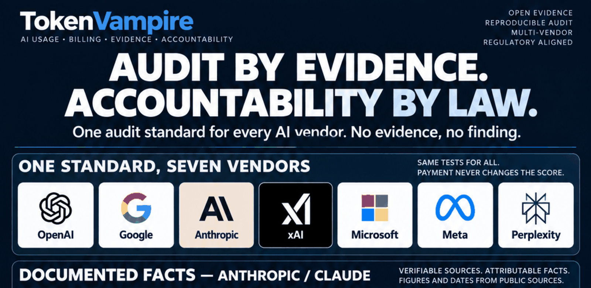

# TokenVampire



<p align="center">
  <strong>LOCAL-FIRST · EVIDENCE-FIRST · VENDOR-NEUTRAL · AR / EN</strong>
</p>

<p align="center">
  <a href="#the-wrapper-ledger">The Wrapper Ledger</a> ·
  <a href="#what-tokenvampire-audits">Audit Controls</a> ·
  <a href="#public-evidence-anthropic--claude">Public Evidence</a> ·
  <a href="#evidence-rules">Evidence Rules</a> ·
  <a href="#build--verify">Build & Verify</a>
</p>

> **AI can sound intelligent and still fail the job. TokenVampire measures the gap between what a system said, what it actually delivered, and what the record can prove.**

TokenVampire is a local-first evidence, billing, subscription, and AI-delivery assurance system.

It does not score intelligence by confidence, fluency, personality, brand, valuation, or marketing language. It scores **observable delivery**.

---

## The Wrapper Ledger

Modern AI products often wrap probabilistic systems in human-like interfaces: first-person language, confidence, memory cues, reassurance, and polished explanations.

TokenVampire treats those interface signals as **presentation**, not proof.

An answer can be fluent and still be wrong.  
An API request can return `200 OK` and still fail the user's task.  
A citation can look valid and still fail to support the claim.  
A usage meter can move without proving that useful work was delivered.  
A credit top-up can appear in a ledger without proving that it was consumed.  
A missing record can look like zero when the correct state is **UNKNOWN**.

TokenVampire keeps those states separate.

```text
REQUEST
  ↓
CLAIM
  ↓
OBSERVABLE ARTIFACT
  ↓
USAGE + CHARGE
  ↓
REWORK
  ↓
REMEDY / RESPONSE
```

> **Generated language is a claim. Observable evidence is a different thing.**

## Governing principle

> **No evidence, no finding. No consent, no export. No verified amount, no loss total. No human approval, no submission.**

When the record supports a number, TokenVampire records the number.  
When the record does not support a number, TokenVampire records **UNKNOWN**.

TokenVampire does not tell the reader which adjective to use. **It publishes the record.**

---

## One standard for every AI vendor

**OpenAI · Google · Anthropic · xAI · Microsoft · Meta · Perplexity · any other provider**

The company name does not change the test. Payment does not change the score.

## What TokenVampire audits

| Control | Audit question |
| --- | --- |
| **1 · Delivery truth** | Was the requested work actually delivered as claimed? |
| **2 · Semantic support** | Do the cited sources and data support the material claim? |
| **3 · Cost & rework** | What usage, charges, retries, and repeat work actually occurred? |
| **4 · Editorial consistency** | Did the system materially alter names, facts, scope, or conclusions without instruction? |
| **5 · User agency & privacy** | Does the user retain control over evidence, data, consent, and export? |
| **6 · Challenge & remedy** | Is there a traceable dispute path and a recorded provider response or remedy? |

## Reality check

| What the interface may say | What the audit requires |
| --- | --- |
| **“I completed the task.”** | An observable artifact that can be independently inspected. |
| **“The source supports this.”** | Semantic support for the exact material claim. |
| **“The request succeeded.”** | The user's acceptance criteria actually passing. |
| **“Your usage was reset.”** | Separate records for limit reset, restored credit, and cash refund. |
| **“No usage is shown.”** | Proof that the value is zero rather than missing or unavailable. |
| **“The hash matches.”** | File identity/integrity only; not automatic truth of every statement inside it. |

---

## Public evidence: Anthropic / Claude

This repository includes a dated, named-vendor study so the audit method can be inspected against public evidence rather than hypothetical examples.

### Documented snapshot

| Record | Documented fact | Source |
| --- | --- | --- |
| **Anthropic postmortem · 23 Apr 2026** | Anthropic described three product changes affecting Claude Code, Claude Agent SDK, and Cowork. It reported a context-management bug that repeatedly dropped prior reasoning and caused cache misses, and said it believes this drove reports of usage limits draining faster than expected. Subscriber usage limits were reset. | [Anthropic](https://www.anthropic.com/engineering/april-23-postmortem) |
| **claude.ai · 6 Oct 2026** | **2,029 Trustpilot reviews; 80% 1-star** | [Trustpilot](https://www.trustpilot.com/review/claude.ai) |
| **anthropic.com · 6 Oct 2026** | **499 Trustpilot reviews; 88% 1-star** | [Trustpilot](https://www.trustpilot.com/review/anthropic.com) |
| **Series H · 28 May 2026** | **$65B raised; $965B post-money valuation** | [Anthropic](https://www.anthropic.com/news/series-h) |
| **Revenue run-rate · end Jul 2026** | **>$65B annual revenue run-rate** reported by Reuters | [Reuters syndicated report](https://www.investing.com/news/stock-market-news/anthropic-revenue-run-rate-tops-65-billion-source-says-4864031) |
| **METR · Jul 2025** | **16 experienced developers, 246 tasks; AI-allowed work took 19% longer in that study setting** | [METR](https://metr.org/blog/2025-07-10-early-2025-ai-experienced-os-dev-study/) |

A review count remains a review count.  
A valuation remains a valuation.  
A revenue run-rate remains a run-rate.  
A provider statement remains a provider statement.  
A user report remains a user report until independently reproduced.

**The record is public. The conclusion belongs to the reader, auditor, regulator, customer, or court applying the relevant standard.**

<details>
<summary><strong>Open the full TokenVampire audit board</strong></summary>


</details>

### Research files

- [Anthropic / Claude research package](research/anthropic/2026-10-06/)
- [Infographic sources](research/anthropic/2026-10-06/INFOGRAPHIC_SOURCES.md)
- [Public issue register](research/anthropic/2026-10-06/public_issue_register.csv)
- [Source register](research/anthropic/2026-10-06/source_register.csv)
- [Methodology](research/anthropic/2026-10-06/METHODOLOGY.md)

---

## Evidence rules

- **Missing data = UNKNOWN, never zero.**
- **Credit top-up ≠ measured spend.**
- **Usage-limit reset ≠ cash refund.**
- **A failed probe ≠ a failed project.**
- **Valid citation syntax ≠ semantic support.**
- **A cryptographic hash proves file identity/integrity, not claim truth.**
- **No LLM may be the sole judge of a material finding.**

Canonical evidence states:

`Verified` · `ProviderReported` · `UserAsserted` · `Estimated` · `ScenarioOnly` · `Unknown`

## Legal / governance basis

TokenVampire records technical and financial facts first. **Applicable law supplies the legal label.**

For Saudi use cases, relevant public sources include:

- [Saudi E-Commerce Law](https://laws.boe.gov.sa/BoeLaws/Laws/LawDetails/360de590-0286-4fa5-a243-aa9100c31979/1)
- [Saudi Ministry of Commerce — electronically provided services and the E-Commerce Law](https://mc.gov.sa/ar/mediacenter/News/Pages/10-07-19-01.aspx)
- [Saudi Personal Data Protection Law / National Data Governance Platform](https://dgp.sdaia.gov.sa/wps/portal/pdp/knowledgecenter/details/GPDPL)

Governance references include [NIST AI RMF](https://www.nist.gov/itl/ai-risk-management-framework) and ISO/IEC 42001.

---

## Implemented today

The repository currently contains implemented building blocks for:

- domain truth models and evidence-backed verdicts;
- measured / assumed / unknown value handling;
- billing and usage reconciliation;
- evidence hashing and manifests;
- encrypted local evidence storage and hostile-file ingest controls;
- persisted case data;
- localized report generation;
- CLI report output;
- Arabic / English i18n foundations;
- unit and architecture tests;
- cross-platform CI.

Desktop and broader organization/server experiences remain under development.

## Build & verify

Canonical verification:

```bash
./scripts/verify.sh
```

The verification gate runs locked restore, formatting checks, Release build with warnings as errors, tests, and a tracked-file secret-pattern scan.

Current CLI surface:

```bash
dotnet run --project src/TokenVampire.Cli -- \
  report --ledger case.json --locale en --currency USD
```

Usage:

```text
report --ledger <file.json> [--locale <tag>] [--currency <ISO>] [--out <file>]
```

## Architecture

- **.NET 10 / C#**
- **SQLite**
- encrypted local evidence vault
- Avalonia desktop direction
- optional self-hosted organization mode
- English and Arabic as release-blocking languages
- explicit architecture boundaries and automated verification

## Repository map

- [Product contract](docs/architecture/product-contract.md)
- [Repository map](docs/architecture/repository-map.md)
- [Execution contract](docs/operations/copilot-execution-contract.md)
- [License decision](docs/decisions/LICENSE-DECISION.md)
- [Milestones](docs/operations/milestones.md)
- [Security policy](SECURITY.md)
- [Contribution guide](CONTRIBUTING.md)

---

## The point

TokenVampire is not another AI personality.

**It is an evidence meter.**

It preserves the request, output, artifacts, usage, money, missing data, provenance, rework, and remedy so the difference between **what a system said** and **what reality can prove** remains inspectable.
